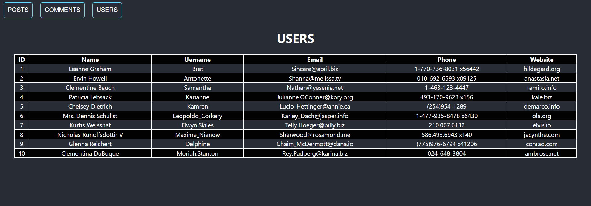

## React Application
  This Project is build using ReactJS. This Web Application is fetching the data from an API (https://jsonplaceholder.typicode.com/)
  
  This is an ```application``` which can display information about the posts, comments and users by using json paceholder api.

  ## Major Concepts Used
   ``` 
   React Hooks, React Functional Components, React State, React Class Components, Axios
   ```
  <h2>ScreenShot</h2>


  
  

